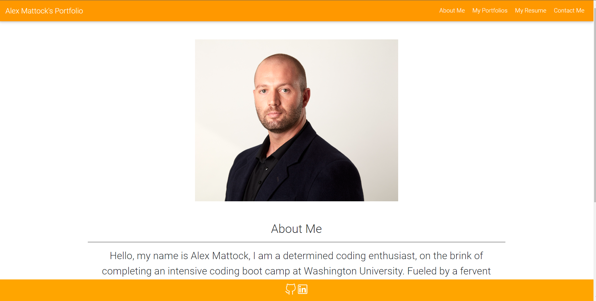
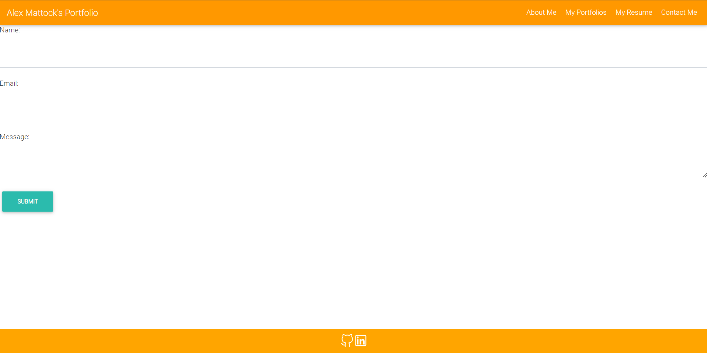
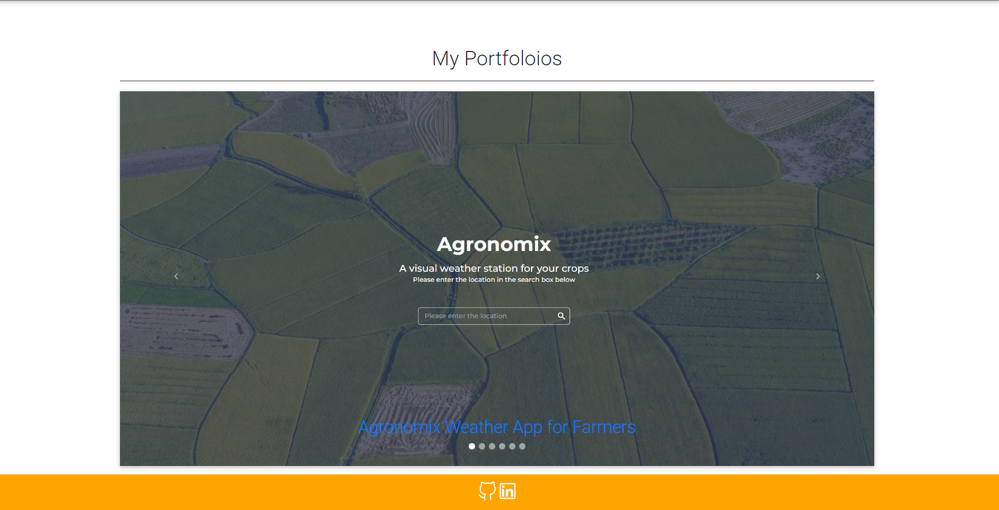
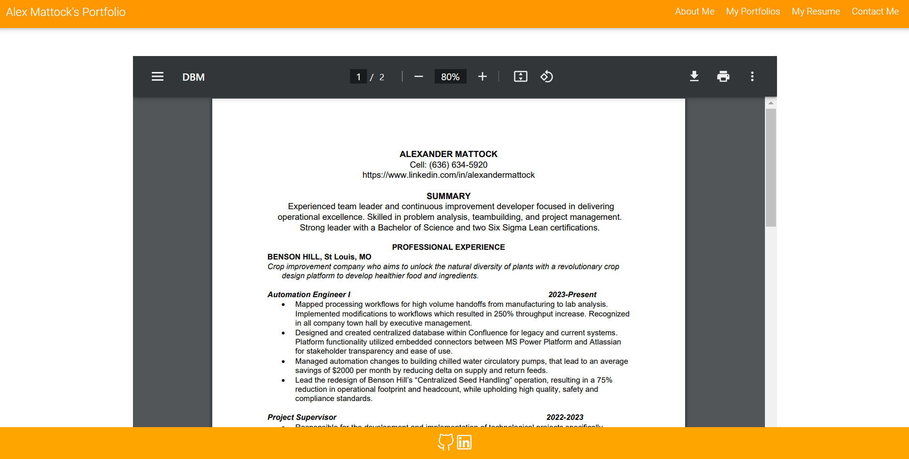

# React-Portfolio
A place to share my projects if i'm applying for jobs or working as a freelancer, also a place to share my work with fellow developers and collaborate on future projects.

## Table of Contents
- [Description](#description)
- [Installation](#installation)
- [Screenshots](#screenshots)
- [Credits](#credits)
- [License](#license)

# Description
This is a portfolio built with React, it is a single page application that uses react-router-dom to navigate between pages. It is a responsive design that uses bootstrap for styling and mdbreact for components. It is deployed on github pages. The site has the following pages: About, Portfolio, Contact, and Resume. The About page has a short bio and a picture of me. The Portfolio page has a carousel of my projects. The Contact page has a form to send me a message. The Resume page is an embedded view and posseses the functioionality o download to my resume.

# Installation
To install this project you will need to clone the repository and run `npm install` to install the dependencies. You will also need to install react-router-dom, mdbreact, and react-bootstrap. To run the project locally you will need to run `npm start` in the terminal. To deploy the project to github pages you will need to run `npm run deploy` in the terminal.

# Credits
- [React](https://reactjs.org/)
- [MDB] (https://www.youtube.com/watch?v=6Ptp94YvQ9c)
- [Vite] (https://stackoverflow.com/questions/72414081/vite-could-not-resolve-entry-module-index-html)
- [MDBBootstrap] (https://mdbootstrap.com/learn/mdb-foundations/mdb-ui-kit/half-carousel/)

# Screenshots

# License
MIT License

Copyright (c) 2023 amattock

Permission is hereby granted, free of charge, to any person obtaining a copy
of this software and associated documentation files (the "Software"), to deal
in the Software without restriction, including without limitation the rights
to use, copy, modify, merge, publish, distribute, sublicense, and/or sell
copies of the Software, and to permit persons to whom the Software is
furnished to do so, subject to the following conditions:

The above copyright notice and this permission notice shall be included in all
copies or substantial portions of the Software.

THE SOFTWARE IS PROVIDED "AS IS", WITHOUT WARRANTY OF ANY KIND, EXPRESS OR
IMPLIED, INCLUDING BUT NOT LIMITED TO THE WARRANTIES OF MERCHANTABILITY,
FITNESS FOR A PARTICULAR PURPOSE AND NONINFRINGEMENT. IN NO EVENT SHALL THE
AUTHORS OR COPYRIGHT HOLDERS BE LIABLE FOR ANY CLAIM, DAMAGES OR OTHER
LIABILITY, WHETHER IN AN ACTION OF CONTRACT, TORT OR OTHERWISE, ARISING FROM,
OUT OF OR IN CONNECTION WITH THE SOFTWARE OR THE USE OR OTHER DEALINGS IN THE
SOFTWARE.

